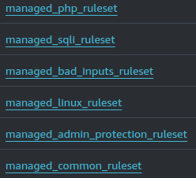

# Spryker PaaS Hosting Services

This document provides an overview of the AWS services used in a Spryker project, relevant for hosting. Each service is essential for different aspects of the Spryker PaaS Hosting concept.

| Icon                                                                                                                                 | Service              | Description                                                                                                                                             | Link                                                                                                                                                                                                                             |
|--------------------------------------------------------------------------------------------------------------------------------------|----------------------|---------------------------------------------------------------------------------------------------------------------------------------------------------|----------------------------------------------------------------------------------------------------------------------------------------------------------------------------------------------------------------------------------|
|       | CodeDeploy           | Automates code deployments to any instance, including Amazon EC2 instances and instances running on-premises.                                           | [CodeDeploy](https://eu-central-1.console.aws.amazon.com/codesuite/codedeploy/deployments?region=eu-central-1&deployments-meta=eyJmIjp7InRleHQiOiIifSwicyI6e30sIm4iOjUwLCJpIjowfQ)                                               |
|               | S3                   | Scalable storage in the cloud.                                                                                                                          | [S3](https://eu-central-1.console.aws.amazon.com/s3/home?region=eu-central-1#)                                                                                                                                                   |
|        | CodeBuild            | Compiles source code, runs tests, and produces software packages that are ready to deploy.                                                              | [CodeBuild](https://eu-central-1.console.aws.amazon.com/codesuite/codebuild/home?region=eu-central-1#)                                                                                                                           |
|       | CloudWatch           | Monitoring and observability service built for DevOps engineers, developers, site reliability engineers (SREs), and IT managers.                        | [CloudWatch](https://eu-central-1.console.aws.amazon.com/cloudwatch/home?region=eu-central-1#home:)                                                                                                                              |
|      | ElastiCache          | Deploy, operate, and scale an in-memory cache in the cloud.                                                                                             | [ElastiCache](https://eu-central-1.console.aws.amazon.com/elasticache/home?region=eu-central-1#/)                                                                                                                                |
|              | RDS                  | Set up, operate, and scale a relational database in the cloud.                                                                                          | [RDS](https://eu-central-1.console.aws.amazon.com/rds/home?region=eu-central-1#)                                                                                                                                                 |
|        | Amazon MQ            | Managed message broker service for Apache ActiveMQ and RabbitMQ.                                                                                        | [Amazon MQ](https://eu-central-1.console.aws.amazon.com/amazon-mq/home?region=eu-central-1#/)                                                                                                                                    |
|              | ECR                  | Fully managed Docker container registry that makes it easy to store, manage, and deploy Docker container images.                                        | [ECR](https://eu-central-1.console.aws.amazon.com/ecr/private-registry/repositories?region=eu-central-1)                                                                                                                         |
|       | OpenSearch           | Search, visualize, and analyze up to petabytes of text and unstructured data.                                                                           | [OpenSearch](https://eu-central-1.console.aws.amazon.com/aos/home?region=eu-central-1#opensearch/dashboard)                                                                                                                      |
|  | Systems Manager      | Provides a unified user interface so you can view operational data from multiple AWS services and automate operational tasks across your AWS resources. | [Systems Manager](https://eu-central-1.console.aws.amazon.com/systems-manager/home?region=eu-central-1#)                                                                                                                         |
|    | Simple Email Service | - Used to configure identities (sender emailaddress) - Can be set to Sandbox mode, only allows sending mails to configured email addresses              | [SES](https://eu-central-1.console.aws.amazon.com/ses/home?region=eu-central-1)                                                                                                                                                  |
|                                                   | EC2                  | Provides scalable computing capacity in the Amazon Web Services (AWS) cloud.                                                                            | [EC2](https://eu-central-1.console.aws.amazon.com/ec2/home?region=eu-central-1#Home:)                                                                                                                                            |
|                                                   | ECS                  | Highly scalable, high-performance container orchestration service that supports Docker containers.                                                      | [ECS](https://eu-central-1.console.aws.amazon.com/ecs/v2/clusters?region=eu-central-1)                                                                                                                                           |
|                                          | CodePipeline         | Continuous integration and continuous delivery service for fast and reliable application and infrastructure updates.                                    | [CodePipeline](https://eu-central-1.console.aws.amazon.com/codesuite/codepipeline/pipelines?region=eu-central-1&pipelines-meta=eyJmIjp7InRleHQiOiIifSwicyI6eyJwcm9wZXJ0eSI6InVwZGF0ZWQiLCJkaXJlY3Rpb24iOi0xfSwibiI6MzAsImkiOjB9) |
|                                                   | SNS                  | Fully managed messaging service for both application-to-application (A2A) and application-to-person (A2P) communication.                                | [SNS](https://eu-central-1.console.aws.amazon.com/sns/v3/home?region=eu-central-1#/homepage)                                                                                                                                     |
|                                              | Route 53             | Scalable and highly available Domain Name System (DNS) web service.                                                                                     | [Route 53](https://us-east-1.console.aws.amazon.com/route53/v2/home?region=eu-central-1#Dashboard)                                                                                                                               |
|                                                   | WAF                  | Web application firewall that helps protect your web applications or APIs against common web exploits.                                                  | [WAF](https://us-east-1.console.aws.amazon.com/wafv2/homev2/home?region=eu-central-1#/)                                                                                                                                          |
